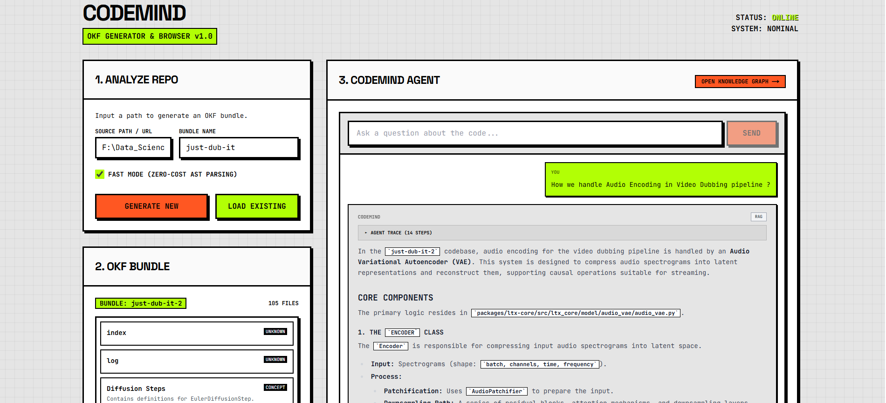
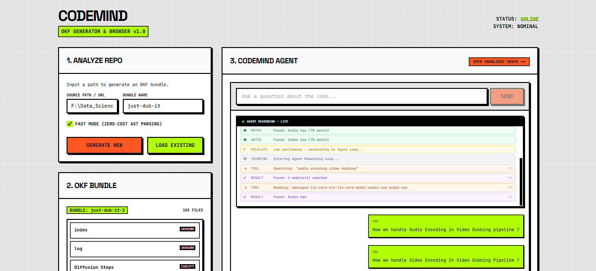

# CodeMind — Open Knowledge Format (OKF) Engine

<p align="center">
  
</p>

Modern codebases are massive, highly decoupled, and increasingly difficult to navigate. Standard AI tools do blind vector search — retrieving isolated snippets without understanding the actual architecture they belong to.

**CodeMind** solves this with the **Open Knowledge Format (OKF)** — a deterministic pipeline that transforms any raw repository into a structured, relational knowledge graph. A developer can drop in any GitHub URL and immediately ask deep architectural questions about it, with the agent showing its reasoning in real time.

---

## How It Works

CodeMind's pipeline is designed around **three core principles:** zero-hallucination, zero-wasted tokens, and complete transparency.

### 1. AST-Based Knowledge Extraction (Zero LLM Cost)

Before any AI is involved, the OKF pipeline statically parses every file using **Tree-sitter** (for JS/TS/TSX) and Python's native `ast` module. It extracts:

- Function signatures, class definitions, method lists
- Module-level docstrings and inline imports
- Dependency chains (who imports what)

This produces deterministic `.okf` files — structured Markdown with YAML frontmatter — at a fraction of the cost of LLM summarization.

### 2. Intent-First Agentic Chat

The chat agent doesn't blindly retrieve on every query. It first **classifies the intent** of the question using pure regex (zero LLM calls), then picks the cheapest strategy:

| Path | Trigger | Cost |
|---|---|---|
| **DIRECT** | "What does this project do?" | 1 LLM call, uses `index.md` only |
| **RAG** | Specific keyword question | 1 LLM call, 1-shot retrieval |
| **AGENTIC** | Relational / trace / multi-hop | 2–5 LLM calls, tool loop |

The Agentic loop uses **Gemini native function calling** with 3 tools: `search_bundle`, `read_module`, and `follow_import`. The `follow_import` tool is unique to OKF — it maps Python import paths directly to their `.okf` files without needing a search.

### 3. Live Reasoning Stream

<p align="center">
  
</p>

Every query streams its reasoning steps live to the UI via **Server-Sent Events (SSE)**. Users watch the agent route the query, search for relevant modules, escalate to the agentic loop if needed, and call tools in real time — before the final answer appears.

---

## The Knowledge Graph

<p align="center">
  
</p>

The OKF pipeline automatically builds a **relational dependency graph** from every analyzed repository.

Nodes represent distinct modules organized by functional category (API, Module, Config, Concept). Directed edges visualize programmatic imports and conceptual links computed from tag similarity (Jaccard). New developers can visually traverse an unfamiliar codebase architecture in seconds.

---

## Architecture

```
┌─────────────────── OKF Pipeline ───────────────────────┐
│                                                         │
│  GitHub URL → Git Clone → AST Parser (Tree-sitter)     │
│       ↓                                                 │
│  ParsedFile → Template Summarizer (Fast Mode, $0)       │
│       ↓                    OR                           │
│  ParsedFile → LLM Summarizer (Standard Mode)            │
│       ↓                                                 │
│  OKF Bundle (.okf Markdown files + graph.json)          │
│                                                         │
│  User Query → Intent Router (regex, free)               │
│       ↓                                                 │
│  DIRECT / RAG / AGENTIC (Gemini Function Calling)       │
│       ↓                                                 │
│  SSE Stream → Live UI → Final Answer + Source Trace     │
└─────────────────────────────────────────────────────────┘
```

---

## Tech Stack

| Layer | Technology |
|---|---|
| **Backend** | Python 3.12, FastAPI, Uvicorn, Pydantic |
| **Parsing** | `ast` (Python), Tree-sitter (JS/TS/TSX) |
| **AI** | Google Gemini via `google-genai` SDK (native function calling) |
| **Graph** | NetworkX, Jaccard similarity |
| **Frontend** | Next.js 14, React 18, React Flow |
| **Streaming** | Server-Sent Events (SSE) |
| **Design** | Custom Neo-Brutalist CSS design system |

---

## Getting Started

### Backend
```bash
cd backend
pip install -r requirements.txt
uvicorn main:app --reload
```

### Frontend
```bash
cd frontend
npm install
npm run dev
```

Navigate to `http://localhost:3000`, paste any GitHub URL, and start asking.
