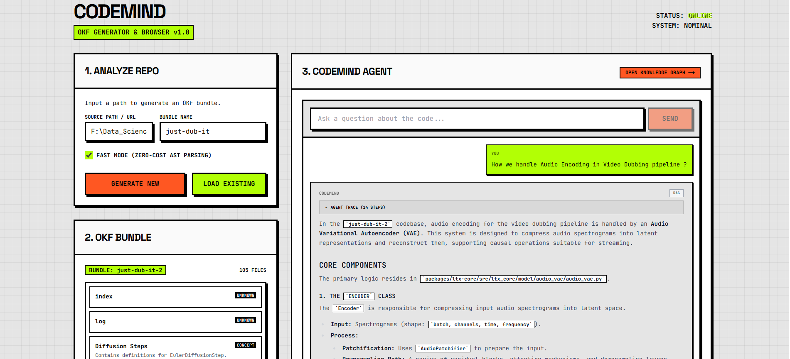
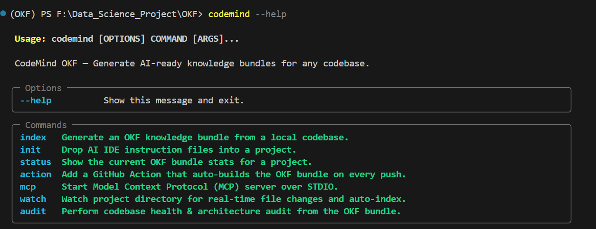
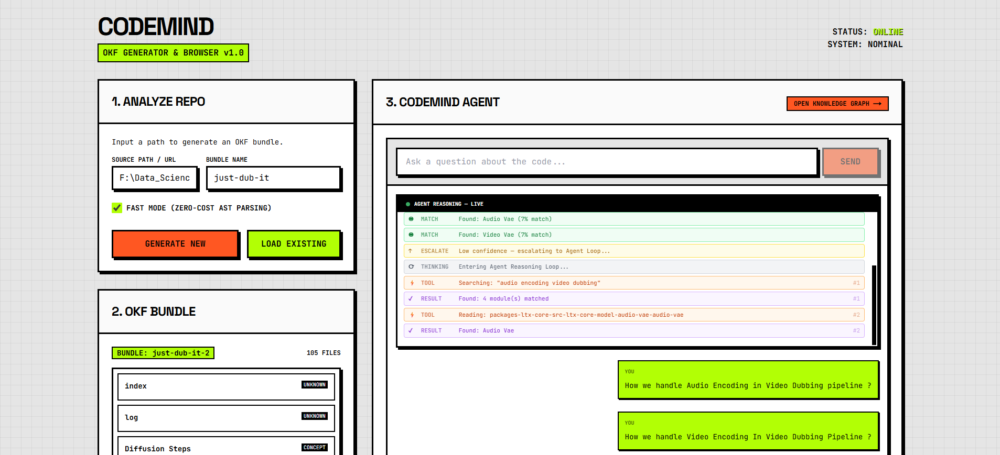

# 🧠 CodeMind — Open Knowledge Format (OKF) Engine

<p align="center">
  
</p>

<p align="center">
  <a href="https://pypi.org/project/codemind-okf/"></a>
  <a href="https://pypi.org/project/codemind-okf/"></a>
  <a href="https://github.com/YashGondaliya36/CodeMind/blob/main/LICENSE"></a>
  <a href="https://modelcontextprotocol.io/"></a>
</p>

---

## 💡 Overview

Modern codebases are massive, highly decoupled, and increasingly difficult to navigate. Standard AI tools do blind vector search — retrieving isolated snippets without understanding the actual architecture they belong to.

**CodeMind** solves this with the **Open Knowledge Format (OKF)** — a deterministic engine that transforms any local repository or GitHub codebase into a structured, relational knowledge bundle. 

It equips AI IDEs (**Cursor**, **Antigravity**, **Claude Desktop**, **GitHub Copilot**) with complete architectural context, enabling zero-hallucination code navigation while cutting LLM token usage by **up to 90%**.

---

## ⚡ Quick Start — Standalone CLI

Install **`codemind-okf`** globally or in your Python virtual environment via PyPI:

```bash
pip install codemind-okf
```

<p align="center">
  
</p>

### Key Commands

```bash
# 🔍 1. Index any project directory (creates .okf/ bundle)
codemind index .

# 🤖 2. Drop AI IDE instructions (.cursorrules, AGENTS.md, copilot-instructions.md)
codemind init

# 🛡️ 3. Run Codebase Architecture & Health Audit (0-100 Score)
codemind audit

# 👁️ 4. Start real-time background file change watcher
codemind watch

# 🔌# 5. Launch native STDIO MCP Server
codemind mcp

# 🧠 6. Manage AI Persistent Memory Log (.okf/memory.md)
codemind memory show
codemind memory ls
codemind memory add "Decided on FastAPI + SQLite" --type decision
```

---

## 🔌 Natively Connect to Cursor, Antigravity IDE, & Claude Desktop (MCP)

CodeMind exposes a production-grade **Model Context Protocol (MCP)** STDIO & HTTP JSON-RPC 2.0 server. Add `codemind` to your global `mcp.json` / `mcp_config.json`:

```json
{
  "mcpServers": {
    "codemind": {
      "command": "uvx",
      "args": [
        "--from",
        "codemind-okf",
        "codemind",
        "mcp"
      ]
    }
  }
}
```

### Exposed MCP Tools

| MCP Tool | Function |
|---|---|
| 🧠 `remember(content, type)` | **Persists AI decisions, tasks, context & bugs into `.okf/memory.md` across sessions & IDEs** |
| 🔄 `recall(query)` | **Retrieves relevant past memories at session start to eliminate context loss** |
| 📚 `get_project_index` | Reads the master architecture map (`index.md`) |
| 🔍 `search_bundle(query)` | Sub-word & token search across all project modules in milliseconds |
| 📖 `read_module(slug)` | Reads specific module AST metadata, classes & function signatures |
| 🔗 `trace_dependencies(slug)` | Traces programmatic imports and component relationships |
| 📁 `list_bundles` | Discovers available `.okf/` knowledge bundles |

---

## 🔥 Key Features

### 1. 🧠 Cross-IDE AI Persistent Memory (`.okf/memory.md`)
AI assistants in **Cursor**, **Antigravity**, **Zed**, and **Claude Desktop** call `remember()` to automatically log architectural decisions, tasks, context snapshots, and bug reports. When starting a new session or switching IDEs, the AI calls `recall()` to instantly restore past decision context — zero amnesia!

### 2. ⚡ SHA-256 Incremental Indexing (`.okf/.checksums.json`)
CodeMind tracks SHA-256 file fingerprints. On subsequent runs (`codemind index .`), unchanged files skip AST parsing instantly (**0.05s execution time**), updating only modified files and pruning deleted source modules.

### 3. 🛡️ Codebase Health & Architecture Audit (`codemind audit`)
Analyzes module line density (>300 LOC monolithic warnings), docstring coverage density, and architectural layer distribution into a clean **Health Score (0-100 A+)**.

<p align="center">
  
</p>

### 3. 🧠 AST-Based Knowledge Extraction (Zero LLM Cost)
Static parsing powered by **Tree-sitter** (for JS/TS/TSX) and Python `ast`. Extracts class hierarchies, function signatures, module docstrings, and imports without spending any LLM API credits.

### 4. 💬 Intent-First Agentic Web UI & Live Reasoning Stream
The optional web application (`backend/` + `frontend/`) provides real-time query routing (DIRECT vs RAG vs AGENTIC) with **Server-Sent Events (SSE)** live agent reasoning streams.

<p align="center">
  
</p>

---

## 🏗️ Architecture

```
┌──────────────────────────── CodeMind OKF Engine ────────────────────────────┐
│                                                                              │
│  Project Source Files ──► AST Parser (Tree-sitter / Python ast)              │
│                                 │                                            │
│                                 ▼                                            │
│                 SHA-256 Fingerprint Cache Check                              │
│             (Skip Unchanged 0.05s | Re-parse Modified)                      │
│                                 │                                            │
│                                 ▼                                            │
│                OKF Bundle (.okf/modules/*.md + index.md)                     │
│                                 │                                            │
│           ┌─────────────────────┴─────────────────────┐                      │
│           ▼                                           ▼                      │
│  Model Context Protocol                     AI IDE Instructions              │
│  (codemind mcp STDIO/HTTP)                (.cursorrules / AGENTS.md)         │
│           │                                           │                      │
│           └─────────────────────┬─────────────────────┘                      │
│                                 ▼                                            │
│             Cursor / Antigravity / Copilot / Claude Desktop                  │
│                                                                              │
└──────────────────────────────────────────────────────────────────────────────┘
```

---

## 🛠️ Full Web App Setup (Backend + Frontend)

If you wish to run the full visual dashboard and Web API server locally:

### 1. Backend Server (FastAPI)
```bash
cd backend
pip install -r requirements.txt
uvicorn main:app --reload
```

### 2. Frontend Dashboard (Next.js 14)
```bash
cd frontend
npm install
npm run dev
```

Open `http://localhost:3000` to interact with the visual OKF graph and SSE live reasoning agent.

---

## 📄 License

Distributed under the **MIT License**. See `LICENSE` for details.
